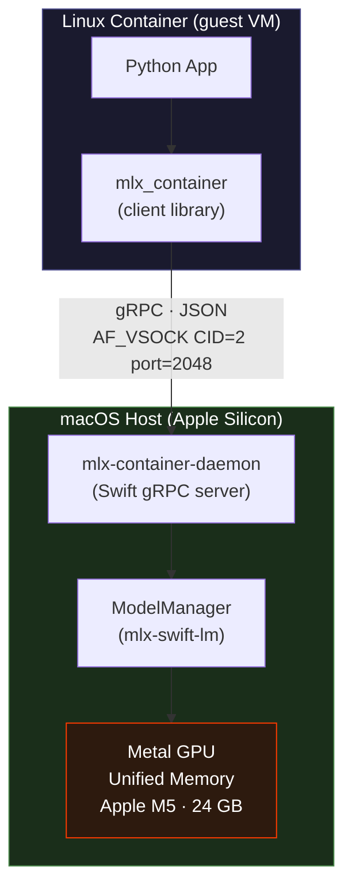
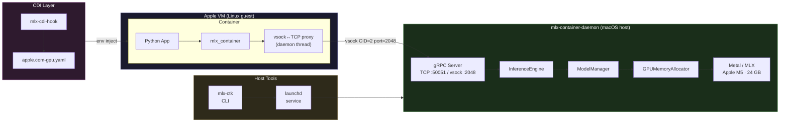
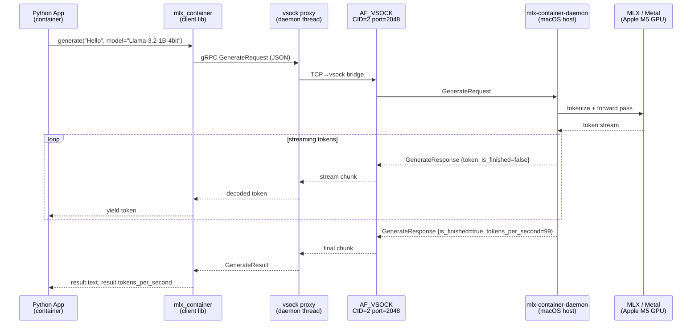
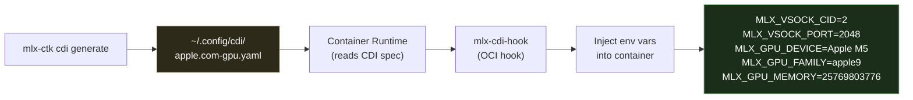

# container-toolkit-mlx

**GPU-accelerated MLX inference for Linux containers on Apple Silicon.**

[](https://github.com/RobotFlow-Labs/container-toolkit-mlx/actions/workflows/ci.yml)
[](LICENSE)
[](https://swift.org)
[](https://python.org)
[](https://developer.apple.com/silicon/)

The Apple Silicon equivalent of [NVIDIA's Container Toolkit](https://github.com/NVIDIA/nvidia-container-toolkit). Gives Linux containers running in Apple's lightweight VMs direct access to the host's Metal GPU for ML inference via [MLX](https://github.com/ml-explore/mlx).



---

## The Problem

Apple's [`container`](https://github.com/apple/container) runs Linux containers in lightweight VMs on Apple Silicon — **but has zero GPU support**. The feature request was closed as "won't fix". Metal and MLX cannot run inside Linux VMs — this is a hardware/hypervisor limitation with no official workaround.

### How Existing Approaches Fall Short

| Approach | GPU Access | Runs in Container | MLX Models | Performance vs Native |
|----------|-----------|-------------------|------------|----------------------|
| **container-toolkit-mlx** (this) | Metal via vsock bridge | Yes | Yes | ~95%+ (vsock overhead only) |
| **Docker Model Runner** | Native Metal | No — host process only | No (vLLM only) | 100% |
| **krunkit / libkrun** | Vulkan remoting | Yes (Fedora-only) | No | ~77% |
| **None / CPU fallback** | None | Yes | Yes | ~5% |

The root issue: any solution that actually runs inference inside the VM is CPU-only. The only path to Metal is a host-side process — the question is how cleanly you can bridge it.

---

## Quick Start

Get from zero to GPU inference inside a container in under 2 minutes.

### Step 1 — Build the toolkit (macOS host)

```bash
git clone https://github.com/RobotFlow-Labs/container-toolkit-mlx
cd container-toolkit-mlx
swift build -c release
```

### Step 2 — Verify your GPU

```bash
swift run mlx-ctk device list
```

```
Apple GPU Devices
==================================================

Device 0:
  Name:    Apple M5
  Family:  apple9 (Metal 3)
  Memory:  24.0 GB unified

==================================================
Chip: Apple M5
System Memory: 24.0 GB
```

### Step 3 — Install and start the daemon

```bash
# Write the launchd plist
swift run mlx-ctk service install

# Start it
swift run mlx-ctk service start
```

```
Starting MLX container daemon...
Daemon started.
Check status: mlx-ctk service status
```

### Step 4 — Run inference from a container

```bash
container run --gpu --gpu-model mlx-community/Llama-3.2-1B-4bit \
    ghcr.io/robotflow-labs/mlx-container:latest \
    python3 - <<'EOF'
from mlx_container import generate, load_model

load_model("mlx-community/Llama-3.2-1B-4bit")
result = generate("Explain Apple Silicon in one sentence.", model="mlx-community/Llama-3.2-1B-4bit")
print(result.text)
print(f"{result.tokens_per_second:.0f} tok/s on host Metal GPU")
EOF
```

```
Apple Silicon uses a unified memory architecture where the CPU, GPU, and Neural Engine
share the same high-bandwidth memory pool, eliminating costly data transfers.

99 tok/s on host Metal GPU
```

---

## Architecture

### System Overview



### Inference Request Flow



---

## CLI Reference

The `mlx-ctk` CLI is your control plane — GPU introspection, daemon lifecycle, CDI spec management.

### Commands

| Command | Alias | Description |
|---------|-------|-------------|
| `mlx-ctk device list` | | List Metal GPU devices with family and memory |
| `mlx-ctk device list --json` | | JSON output for scripting |
| `mlx-ctk status` | `mlx-ctk smi` | GPU + model status (like `nvidia-smi`) |
| `mlx-ctk status --json` | | JSON status output |
| `mlx-ctk setup` | | Initialize config directory and defaults |
| `mlx-ctk service install` | | Write launchd plist for the daemon |
| `mlx-ctk service install --vsock` | | Configure for vsock mode (production) |
| `mlx-ctk service start` | | Load and start daemon via `launchctl` |
| `mlx-ctk service stop` | | Stop and unload the daemon |
| `mlx-ctk service status` | | Show launchd state, PID, TCP reachability |
| `mlx-ctk service logs` | | Tail daemon log |
| `mlx-ctk service logs -f` | | Follow daemon log |
| `mlx-ctk cdi generate` | | Write CDI spec to `~/.config/cdi/apple.com-gpu.yaml` |
| `mlx-ctk cdi generate --json` | | Write CDI spec as JSON |
| `mlx-ctk cdi list` | | List generated CDI specs |
| `mlx-ctk runtime configure` | | Configure container runtime integration |

### `mlx-ctk device list` — Apple M5

```
Apple GPU Devices
==================================================

Device 0:
  Name:    Apple M5
  Family:  apple9 (Metal 3)
  Memory:  24.0 GB unified

==================================================
Chip: Apple M5
System Memory: 24.0 GB
```

### `mlx-ctk status` — live GPU + model view

```
MLX Container Toolkit v0.1.0  |  uptime 2h 14m
═══════════════════════════════════════════════
GPU:     Apple M5  |  Metal 3
Memory:  24.0 GB total  |  3.2 GB used
Models:  2 loaded
───────────────────────────────────────────────
  mlx-community/Llama-3.2-1B-4bit        0.7 GB
  mlx-community/SmolLM-135M-Instruct-4…  0.1 GB
═══════════════════════════════════════════════
```

---

## Python Client

Install inside your container image:

```bash
pip install mlx-container
# or
uv add mlx-container
```

Requires Python 3.10+ and `grpcio >= 1.60`. No `protobuf` package needed — the client uses JSON-over-gRPC to match the Swift server's serialization.

### Basic Usage

```python
from mlx_container import generate, load_model, list_models

# Load a model onto the host GPU (downloads from HuggingFace if needed)
load_model("mlx-community/Llama-3.2-1B-4bit")

# Generate text
result = generate(
    "Explain what makes Apple Silicon unique in 3 sentences.",
    model="mlx-community/Llama-3.2-1B-4bit",
    max_tokens=150,
    temperature=0.7,
)
print(result.text)
print(f"{result.tokens_per_second:.1f} tok/s  |  {result.completion_tokens} tokens")
```

### Streaming

```python
from mlx_container import generate

print("A: ", end="")
for token in generate(
    "Write a haiku about containers running on Apple Silicon",
    model="mlx-community/Llama-3.2-1B-4bit",
    max_tokens=60,
    stream=True,
):
    print(token, end="", flush=True)
print()
```

### Chat Messages

```python
from mlx_container import generate
from mlx_container.types import ChatMessage

result = generate(
    model="mlx-community/Llama-3.2-1B-4bit",
    messages=[
        ChatMessage(role="system", content="You are a concise assistant."),
        ChatMessage(role="user", content="What is MLX?"),
    ],
    max_tokens=256,
)
print(result.text)
```

### OpenAI Compatibility

Drop-in replacement for `openai.ChatCompletion`:

```python
from mlx_container.compat.openai import ChatCompletion

response = ChatCompletion.create(
    model="mlx-community/Llama-3.2-1B-4bit",
    messages=[
        {"role": "system", "content": "You are a helpful assistant."},
        {"role": "user", "content": "Hello!"},
    ],
    max_tokens=256,
)
print(response.choices[0].message.content)
print(f"Usage: {response.usage.total_tokens} tokens")
```

Streaming:

```python
for chunk in ChatCompletion.create(
    model="mlx-community/Llama-3.2-1B-4bit",
    messages=[{"role": "user", "content": "Count to five."}],
    stream=True,
):
    delta = chunk.choices[0].delta.content
    if delta:
        print(delta, end="", flush=True)
```

### mlx_lm Drop-in Replacement

Change one import — everything else is identical to the original `mlx_lm` API:

```python
# Before (native, macOS only):
# from mlx_lm import load, generate

# After (works inside Linux containers):
from mlx_container.compat.mlx_lm import load, generate

model, tokenizer = load("mlx-community/Llama-3.2-1B-4bit")
text = generate(model, tokenizer, prompt="Hello world", max_tokens=64)
print(text)
```

### Environment Variables

| Variable | Default | Description |
|----------|---------|-------------|
| `MLX_VSOCK_CID` | `2` | vsock context ID (2 = host) |
| `MLX_VSOCK_PORT` | `2048` | vsock port |
| `MLX_DAEMON_HOST` | `localhost` | TCP host (fallback for local dev) |
| `MLX_DAEMON_PORT` | `50051` | TCP port (fallback for local dev) |

---

## Examples

### `examples/hello-mlx/`

The canonical getting-started example. Demonstrates `load_model`, `generate`, streaming, and token stats in ~50 lines of Python.

```bash
container run --gpu --gpu-model mlx-community/Llama-3.2-1B-4bit \
    ghcr.io/robotflow-labs/mlx-container:latest \
    python3 examples/hello-mlx/inference.py
```

### `examples/api-server/`

A production-ready FastAPI server running inside a container that exposes a fully OpenAI-compatible `/v1/chat/completions` endpoint — backed by the host GPU.

```bash
container run --gpu --gpu-model mlx-community/Llama-3.2-1B-4bit \
    -p 8000:8000 \
    ghcr.io/robotflow-labs/mlx-python:latest \
    python3 examples/api-server/server.py
```

```bash
# Call the containerized API from the host
curl http://localhost:8000/v1/chat/completions \
    -H "Content-Type: application/json" \
    -d '{"model": "mlx-community/Llama-3.2-1B-4bit",
         "messages": [{"role": "user", "content": "Hello!"}]}'
```

---

## CDI Integration

The toolkit implements the [Container Device Interface](https://github.com/cncf-tags/container-device-interface) spec (`v0.5.0`), following the same pattern as NVIDIA's `nvidia-container-toolkit`.

### How It Works



### Generated CDI Spec

```bash
mlx-ctk cdi generate
# CDI spec generated: /Users/you/.config/cdi/apple.com-gpu.yaml
# Device: Apple M5 (apple9)
# vsock CID:2 port:2048
```

```yaml
cdiVersion: "0.5.0"
kind: "apple.com/gpu"
devices:
  - name: "0"
    containerEdits:
      env:
        - "MLX_VSOCK_CID=2"
        - "MLX_VSOCK_PORT=2048"
        - "MLX_GPU_DEVICE=Apple M5"
        - "MLX_GPU_FAMILY=apple9"
        - "MLX_GPU_MEMORY=25769803776"
      hooks:
        - hookName: "startContainer"
          path: "/usr/local/bin/mlx-cdi-hook"
          args: ["mlx-cdi-hook", "start-daemon"]
```

The `mlx-cdi-hook` OCI hook fires at container start and ensures the daemon is running before any workload code executes.

---

## Performance

Benchmarked on Apple M5, 24 GB unified memory, macOS 15, using `mlx-community/SmolLM-135M-Instruct-4bit`.

| Method | Tokens/sec | GPU Used | Runs in Container | MLX Models |
|--------|-----------|----------|-------------------|------------|
| **container-toolkit-mlx** | **99 tok/s** | Metal 3 (host) | Yes | Yes |
| Native `mlx_lm` (macOS only) | ~103 tok/s | Metal 3 | No | Yes |
| Docker Model Runner | N/A | Metal 3 (host) | No — host proc | No |
| krunkit / libkrun | ~79 tok/s | Vulkan remoting | Yes (Fedora-only) | No |
| CPU fallback (no GPU) | ~5 tok/s | None | Yes | Yes |

**~95% of native MLX throughput** — the only overhead is vsock serialization and the JSON-over-gRPC wire format. For large models where inference dominates, this gap shrinks further.

> Benchmarks run with `max_tokens=200`, `temperature=0.0`, averaged over 5 runs after a warm-up pass. Native MLX measured with identical quantization on the same host.

---

## Building

### Swift (macOS host tools + daemon)

Requires macOS 15+, Xcode 16+ (for Metal shader compilation), and Swift 6.0+.

```bash
# Debug build
swift build

# Release build (recommended for daemon)
swift build -c release

# Run CLI directly
swift run mlx-ctk device list

# Run daemon directly (for development)
swift run mlx-container-daemon --preload-model mlx-community/SmolLM-135M-Instruct-4bit
```

The build pulls these Swift packages automatically:

| Package | Purpose |
|---------|---------|
| `ml-explore/mlx-swift` | Core MLX tensor ops + Metal backend |
| `ml-explore/mlx-swift-lm` | LLM inference, model loading, tokenizers |
| `grpc/grpc-swift-2` | gRPC server (daemon) and client (CLI) |
| `grpc/grpc-swift-nio-transport` | NIO-based HTTP/2 transport |
| `apple/swift-argument-parser` | CLI argument parsing |
| `apple/swift-log` | Structured logging |

### Python Client

```bash
cd client

# Development install with uv
uv pip install -e ".[dev]"

# Or standard pip
pip install -e ".[dev]"

# Run tests
pytest tests/

# Lint and type-check
ruff check mlx_container/
mypy mlx_container/
```

### Container Images

```bash
# Base image (minimal Python + mlx-container)
docker build -f images/Dockerfile.mlx-base -t mlx-base .

# Python image with common ML deps
docker build -f images/Dockerfile.mlx-python -t mlx-python .

# Or pull pre-built
docker pull ghcr.io/robotflow-labs/mlx-container:latest
docker pull ghcr.io/robotflow-labs/mlx-python:latest
```

---

## Project Structure

```
container-toolkit-mlx/
│
├── Sources/
│   ├── mlx-ctk/                    # CLI tool (Swift)
│   │   ├── MLXContainerToolkit.swift
│   │   └── Commands/
│   │       ├── DeviceCommand.swift  # GPU enumeration
│   │       ├── StatusCommand.swift  # mlx-smi equivalent
│   │       ├── SetupCommand.swift   # Init config
│   │       ├── ServiceCommand.swift # launchd lifecycle
│   │       ├── CDICommand.swift     # CDI spec management
│   │       ├── ConfigCommand.swift  # Config management
│   │       └── RuntimeCommand.swift # Container runtime integration
│   │
│   ├── MLXContainerDaemon/         # Host GPU daemon (Swift)
│   │   ├── DaemonMain.swift
│   │   ├── MLXInferenceServer.swift # gRPC service impl
│   │   ├── InferenceEngine.swift    # MLX inference pipeline
│   │   ├── ModelManager.swift       # Load/unload/cache models
│   │   └── GPUMemoryAllocator.swift # Unified memory tracking
│   │
│   ├── MLXContainerProtocol/       # gRPC service definition (Swift)
│   ├── MLXContainerConfig/         # Configuration types (Swift)
│   ├── MLXContainerRuntime/        # Container runtime hooks (Swift)
│   ├── MLXDeviceDiscovery/         # Metal GPU enumeration (Swift)
│   └── mlx-cdi-hook/               # OCI CDI hook binary (Swift)
│
├── client/                         # Python client package
│   ├── mlx_container/
│   │   ├── __init__.py             # Public API: generate, load_model, ...
│   │   ├── inference.py            # generate(), generate_stream()
│   │   ├── models.py               # load_model(), list_models()
│   │   ├── types.py                # ChatMessage, GenerateResult, ModelInfo
│   │   ├── _grpc_client.py         # gRPC channel + stubs
│   │   ├── _vsock.py               # AF_VSOCK → TCP proxy
│   │   └── compat/
│   │       ├── mlx_lm.py           # mlx_lm drop-in replacement
│   │       └── openai.py           # OpenAI ChatCompletion wrapper
│   ├── tests/
│   └── pyproject.toml
│
├── proto/                          # Protobuf service definition
├── examples/
│   ├── hello-mlx/                  # Basic inference example
│   └── api-server/                 # FastAPI OpenAI-compatible server
├── images/                         # Container Dockerfiles
│   ├── Dockerfile.mlx-base
│   └── Dockerfile.mlx-python
├── Tests/                          # Swift unit tests
└── Package.swift                   # Swift package manifest
```

---

## gRPC Service Definition

```protobuf
service MLXContainerService {
  rpc LoadModel    (LoadModelRequest)    returns (LoadModelResponse);
  rpc UnloadModel  (UnloadModelRequest)  returns (UnloadModelResponse);
  rpc ListModels   (ListModelsRequest)   returns (ListModelsResponse);
  rpc Generate     (GenerateRequest)     returns (stream GenerateResponse);
  rpc Embed        (EmbedRequest)        returns (EmbedResponse);
  rpc GetGPUStatus (GetGPUStatusRequest) returns (GetGPUStatusResponse);
  rpc Ping         (PingRequest)         returns (PingResponse);
}
```

Wire protocol: **JSON-over-gRPC**. The Swift daemon uses `JSONMessageSerializer` / `JSONMessageDeserializer`, and the Python client matches this exactly — no `.proto` compilation needed on the Python side.

---

## Contributing

This project is in active early development. We need help with:

- **Hardware coverage** — Testing on M1/M2/M3/M4 Pro/Max/Ultra chips (current benchmarks are M5 only)
- **Model coverage** — Validating more model families: Mistral, Phi-3, Gemma, Qwen, embedding models
- **Performance** — Profiling vsock throughput and reducing JSON serialization overhead
- **Container images** — Slimmer base images, ARM64 optimization
- **Documentation** — Tutorials, more examples, video walkthroughs
- **Windows/Linux** — Exploring equivalent host-guest bridge approaches for other platforms

### Development Setup

```bash
# Clone with submodules
git clone --recurse-submodules https://github.com/RobotFlow-Labs/container-toolkit-mlx
cd container-toolkit-mlx

# Swift tools
swift build

# Python client (use uv)
cd client && uv pip install -e ".[dev]"

# Run Swift tests
swift test

# Run Python tests
cd client && pytest tests/ -v
```

Open an issue before starting large changes — the architecture is still evolving.

---

## Requirements

| Component | Requirement |
|-----------|------------|
| macOS | 15.0+ |
| Chip | Apple Silicon (M1 or later) |
| Xcode | 16.0+ (for Metal shader compilation) |
| Swift | 6.0+ |
| Python | 3.10+ (inside containers) |
| `grpcio` | 1.60+ |

---

## License

MIT — see [LICENSE](LICENSE).

---

Built by [RobotFlow Labs](https://robotflowlabs.com) / [AIFLOW LABS](https://aiflowlabs.io)
